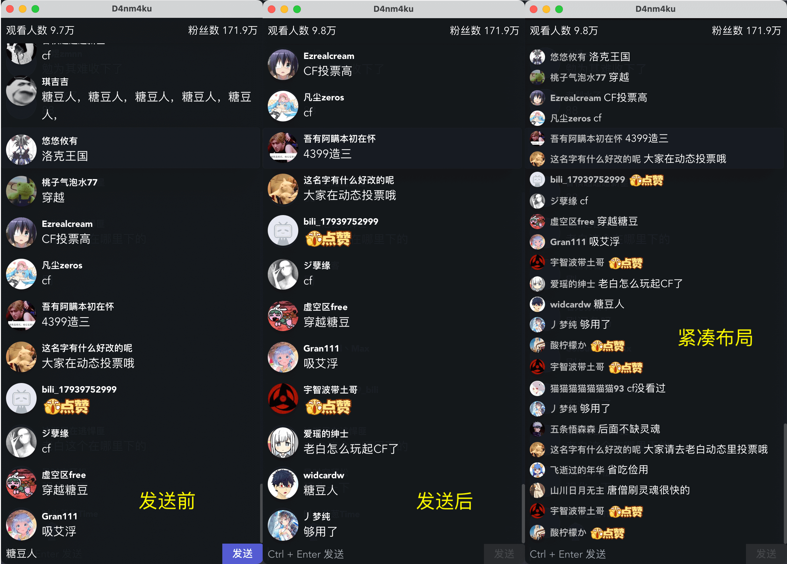
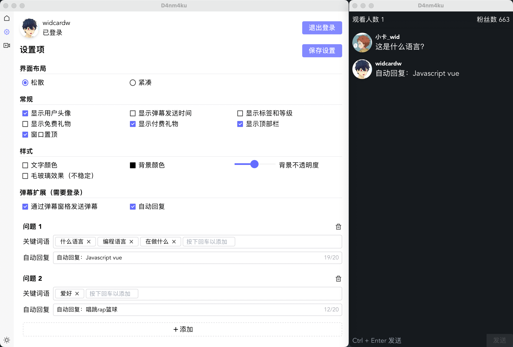
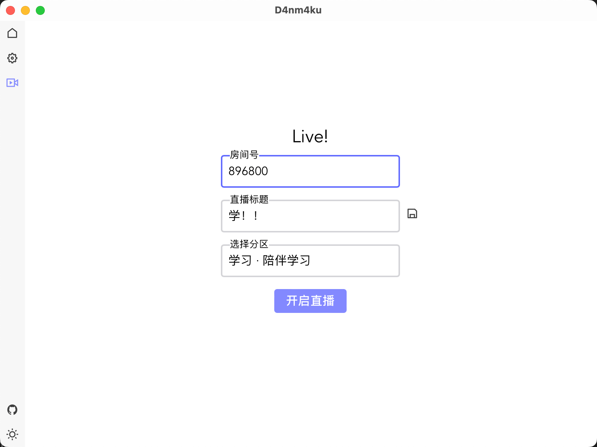

# D4nm4ku

 

使用 Tauri 和 Vue 实现一个弹幕姬。

> 后续会考虑使用 rust 作为后端来接收弹幕，而前端仅做数据的显示。目前时间和精力不是很足，因此暂时先搁置。

## 下载 APP

至 [release](https://github.com/widcardw/D4nm4ku/releases) 页面下载

| Platform | Installer |
|:--------:|:-------:|
| Windows | D4nm4ku_version_x64_en-US.msi |
| macOS Apple Silicon | D4nm4ku_version_aarch64.dmg |
| macOS Intel x64 | D4nm4ku_version_x64.dmg |
| Linux | d4nm4ku_version_amd64.deb <br> d4nm4ku_version_amd64.AppImage |

## 构建

```sh
pnpm install
pnpm tauri dev      # dev
pnpm tauri build    # build
```

## 功能预想

### 弹幕部分

#### 弹幕

- [x] 主要：用户头像，用户名，弹幕内容，礼物，人气
- [ ] 可选：
    - [x] 用户等级
    - [x] 谁的舰长
    - [ ] 是否为粉丝
    - [x] 入场
    - [x] 关注主播

#### 主播回复

- [x] 主动输入回复
- [x] 关键字触发回复
    - [x] 使用队列存储
        - 好像用不着了？
    - [x] 通过关键字 Hash ，不再回复一段时间内已经重复的内容（设置回复内容的 TTL ）
    - [x] 过长的弹幕需要分段延迟回复

#### 扩展功能

- [x] 醒目留言
- [x] 可选：是否只显示付费礼物，礼物金额，礼物连击（可能稍微有一点问题，或许还是在队列里面写）
- [ ] 可选：语音播报（感谢 xxx 的礼物，关注主播，等等）
- [ ] 弹幕投票

### 其他

- [x] 优化登录界面
- [ ] 不知道有没有自动验证的 API ，这样登录一次就不用再次登录了
    - 好像是定时失效的吧，这就不管了，能用就行
- [x] 将弹幕窗口化
- [x] 添加配置
    - [x] 窗口背景色
    - [x] 窗口透明度
    - [x] 弹幕文字颜色
    - [x] 舰长加背景色（或者文字颜色）
    - [x] 可隐藏头像
    - [x] 可隐藏时间
    - [ ] 粉丝加背景色
    - [ ] 考虑要不要加原生 API 的毛玻璃效果
        - 来自 tauri 的 API [`run_on_main_thread`](https://docs.rs/tauri/1.1.1/tauri/struct.AppHandle.html#method.run_on_main_thread) 和插件 [window-vibrancy](https://docs.rs/window-vibrancy/0.3.0/window_vibrancy/) 可以实现原生的毛玻璃效果
- [ ] 优化界面
    - [x] 考虑是否将启动小窗的界面合并到主界面
        - 但是之前测试根目录组件使用带有 store 的组件会报错，说 pinia 未定义
    - [ ] 设置界面
        - 或许还要加一些功能
- [x] 开播
    - [x] 更改直播间标题
    - [x] 开播
- [ ] 窗口
    - [x] 置顶
    - [x] 保存和加载窗口的位置和大小
    - [ ] 点击穿透（在 [tao](https://docs.rs/tao/0.14.0/tao/) 的 [API](https://docs.rs/tao/0.14.0/tao/window/struct.Window.html#method.set_ignore_cursor_events) 中已经有了，但是没有开放到 tauri 中）
        - [ ] tauri 的 [issue](https://github.com/tauri-apps/tao/issues/184#issuecomment-1097109451) 中说要到 v2 时候才会正式公开这个 api
        - [x] [#184-comment1](https://github.com/tauri-apps/tao/issues/184#issuecomment-1134823892) 给出了 macOS 的解决方案
        - [ ] [#184-comment2](https://github.com/tauri-apps/tao/issues/184#issuecomment-1118176176) 给出了 Windows 的解决方案
    - [ ] 将弹幕浏览器显示到所有桌面 (macOS) 详见 [#1](https://github.com/widcardw/D4nm4ku/issues/1)

## 部分效果呈现

### 基本功能



### 自动回复



### 开启直播


